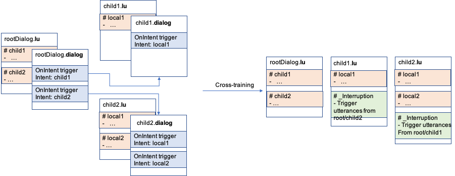

# `luis:cross-train`
Cross-train writes out updated .lu files that contain cross-trained `_interruption` as well as `DeferToRecognizer` intent. 

Cross-train is required to use the [CrossTrainedRecognizerSet][1] available as part of [adaptive dialogs][2] as well as if you are looking or CI/CD support for [Composer][3] generated bots.

## What is cross-train? 
With [adaptive dialog][2], you now have the ability to use one [LUIS.ai][4] application per dialog. Cross train command supports this by adding an `_Interruption` intent for each child LUIS application for your bot that has the trigger utterances from all other siblings to that child. 



In cases where you are taking advantage of [CrossTrainedRecognizerSet][1], cross train command also sets up a `DeferToRecognizer_QnA_DialogName` with questions from [.qna files][5] automatically pulled in for any dialog.

## Usage

```bash
> bf luis:cross-train --in <source .lu files> --out <output folder> --config <cross-train configuration>
```

A cross-train configuration is necessary for the command to work. Here is an example cross-train configuration 

```jsonc
{
    // list each .lu file including variations per lang x locale. 
    // Lang x locale is denoted using 4 letter code. e.g. it-it, fr-fr
    // Paths can either be absolute (full) paths or paths relative to this config file.
    "./RootDialog/RootDialog.lu": {
        // indicate if this is an .lu file for a root dialog.
        "rootDialog": true,
        // list of trigers within that dialog
        "triggers": {
            // Key is name of intent within the .lu file (in this case RootDialog.lu) 
            // Value is the path to the child dialog's .lu file.
            "AddItem": "./AddToDoDialog/AddToDoDialog.lu",
            "DeleteItem": "./DeleteToDoDialog/DeleteToDoDialog.lu",
            "ViewItem": "./ViewToDoDialog/ViewToDoDialog.lu",
            "GetUserProfile": "./GetUserProfileDialog/GetUserProfileDialog.lu"
        }
    }
}
```

## Related commands
You might find these additional commands relevant/ helpful - 

- [bf luis:build][6]
- [bf qnamaker:cross-train][7]
- [bf qnamaker:build][8]

[1]:https://docs.microsoft.com/en-us/azure/bot-service/bot-builder-concept-adaptive-dialog-recognizers?view=azure-bot-service-4.0#cross-trained-recognizer-set
[2]:https://aka.ms/adaptive-dialogs
[3]:https://aka.ms/composer
[4]:https://luis.ai
[5]:https://aka.ms/qna-file-format
[6]:./using-luis-build.md
[7]:../../qnamaker/docs/using-cross-train-command.md
[8]:../../qnamaker/using-qnamaker-build.md