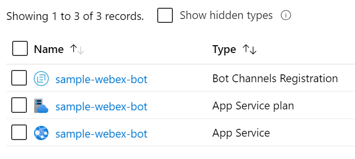

# Bot Deployment Task Dev Spec One-Pager

## Summary

The task wraps [AZ CLI](https://docs.microsoft.com/en-us/cli/azure/?view=azure-cli-latest) deployment commands to deploy a published bot zip file to Azure using the [Azure Resource Manager templates](https://azure.microsoft.com/en-in/documentation/articles/resource-group-template-deploy/), and to connect it with channels as Direct Line, Slack, Twilio, Facebook or Webex.

The task requires a zipped bot project as an input parameter, and does a [zip-deploy](https://github.com/projectkudu/kudu/wiki/Deploying-from-a-zip-file-or-url) to upload and deploy the bot to Azure.

This allows the task to be able to deploy any bot, whether they are .NET, JS or Python*, or use cognitive services such as LUIS, as long as they use the proper template and are zipped and prepared as the zip deployment is indicated for the language (see [link](https://docs.microsoft.com/en-us/azure/bot-service/bot-builder-deploy-az-cli?view=azure-bot-service-4.0&tabs=csharp#5-prepare-your-code-for-deployment)).

_(*) Python bots are deployed in Linux environments, therefore the pipeline needs to be set with a Linux agent._

## Requirements

#### Azure Subscription

To deploy to Azure, an Azure subscription has to be linked to Team Foundation Server or to Azure Pipelines using the Services tab in the Account Administration section.

### Prerequisites

- Bot project published in a zip file
- ARM template
- [Microsoft App Registration](https://portal.azure.com/#blade/Microsoft_AAD_RegisteredApps/ApplicationsListBlade) (_AppId_ and _AppSecret_)

### Use Cases

This task is used to deploy a bot to Azure

These are some of the possible use cases:

- Deployment with Validation Mode (no resources will be deployed).
- Deployment with an ARM parameters file.
- Deployment with an ARM parameters file and overriding some parameters.
- Deployment connecting the bot with the Direct Line and MS Teams channels.
- Deployment connecting the bot with the Slack channel.
- Deployment connecting the bot with a Facebook page.
- Deployment connecting the bot with a Twilio number.
- Deployment connecting the bot with a Webex channel.

## Design Specifications

The UI of the task keeps consistency with the Azure Pipeline Tasks style. Also maintains most of their input's names.

### Parameters of the task

The parameters listed with a * are required for the task:

- **Azure Subscription***: The service connection name linked with the Azure Subscription where the resources will be created.

- **Deployment Scope***: The scope for the deployment. It could be a deployment to a *Subscription* level or to a *Resource Group*.

- **Resource Group***: The name for the resource group, either existing or to be created.

- **Location***: The location where the resource group will be created.

- **Template***: Full path or a pattern pointing for the [Azure Resources Manager](https://docs.microsoft.com/en-us/azure/azure-resource-manager/templates/) template file for the project.

- **Template Parameters**: Full path or a pattern pointing for the parameters file for the Azure Resource Manager template.

- **Override Template Parameters**: A grid to override any parameter of the parameters file. The parameters name and value go separated by spaces as follows:

  `-<parameter1> <value1> -<parameter2> <value2> `

- **Validation Mode**: Enables a syntactical validation of the template without creating actual resources.

- **Zipped bot***: Path to the package or folder containing the zipped bot's project in a format compatible with the [kudu zip deployment](https://docs.microsoft.com/en-us/azure/bot-service/bot-builder-deploy-az-cli?view=azure-bot-service-4.0&tabs=csharp#5-prepare-your-code-for-deployment).

- **Connection with Channels**: You can select the channel your bot will connect to.

  - **Direct Line**
  - **Slack**
  - **Teams**
  - **Webex**
  - **Facebook**
  - **Twilio**

  *Note: Slack, Webex, Facebook and Twilio need extra credentials that will be required once the check box is selected.*

## Usage and installation

**Installing**

- Install the task from [Azure DevOps marketplace](https://marketplace.visualstudio.com/items?itemName=Southworks-Pipelines-Test.bot-deployment).

- Select the organization you want to use the task and click on install. 

- Then click **Proceed to organization**.

**Running**

- In Azure DevOps go to your pipeline or create a new one.
- Adding a new task, search for **Bot Deployment**.

- Fill in the [parameters](#parameters-of-the-task).
- Run the pipeline. The step will display output in the console at the DevOps job view.
- Once the step ran you should see the indicator of the step having run successfully or not.
- If successful, the bot should be visibly deployed in Azure, and should be responsive when tested for conversation.

## Task workflow

The task internally executes the following flow:

**Login to Azure**: Run *az login* command.

If **Validation Mode = true**

- Run *az deployment validate* command.

If **Validation Mode = false**

- Check **Resource Group existence**: Run *az group exists* command. If it doesn't exist: Run *az group create* command.
- **Resources Deployment**
  - Scope ***Resource Group***: Run *az group deployment create* command.
  - Scope ***Subscription***: Run *az deployment create* command.
- **Bot Deployment**: Run *az webapp deployment source config-zip* command to deploy the zipped bot.
- **Connection with Channels**:
  - Direct Line: Run *az bot directline create* command.
  - MS Teams: Run *az bot msteams create* command.
  - Slack: add the Slack extra parameters to the Resources Deployment step.
  - Webex: add the Webex extra parameters to the Resources Deployment step.
  - Facebook: add the Facebook extra parameters to the Resources Deployment step.
  - Twilio: add the Twilio extra parameters to the Resources Deployment step.

**Finish** execution.

The final result is the bot deployed in Azure, you can check it on [Azure Portal](https://portal.azure.com/) in the resource group you used for the deploy.

## Special Considerations

The connection with the Slack, Twilio, Facebook and Webex channels is made through the [BotFramework SDK Adapters](https://github.com/microsoft/botbuilder-dotnet/tree/master/libraries/Adapters). Therefore, the deployed bot must include the corresponding adapters to connect with these channels.

## Issues

- TODO: Add telemetry to identify the use of the AZ CLI throughout the task.